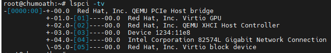
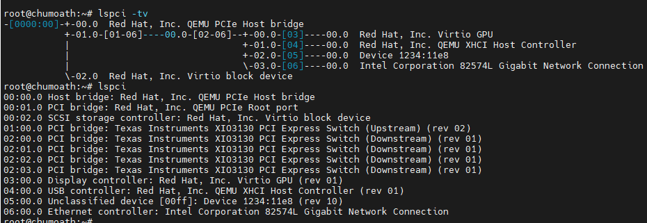
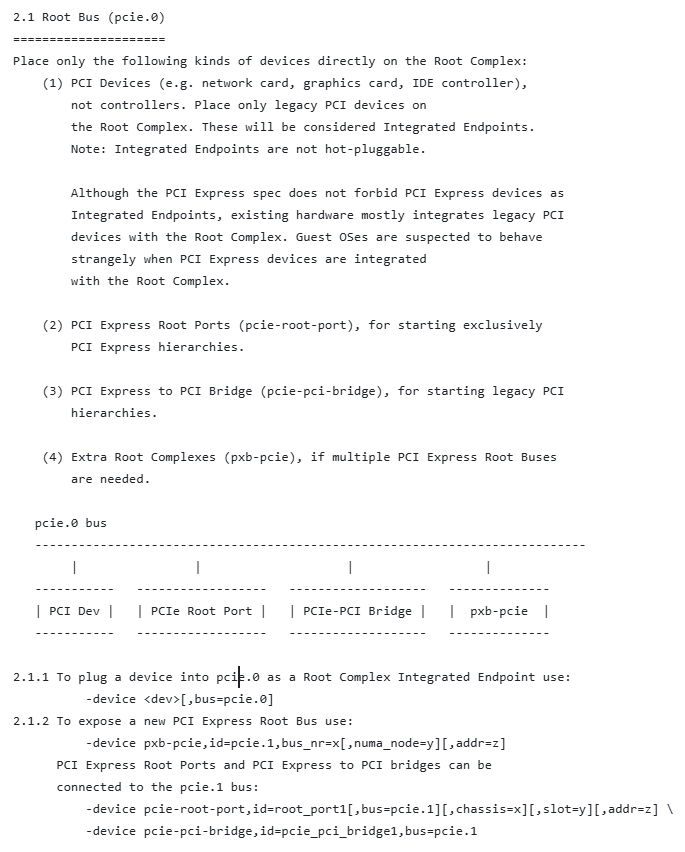
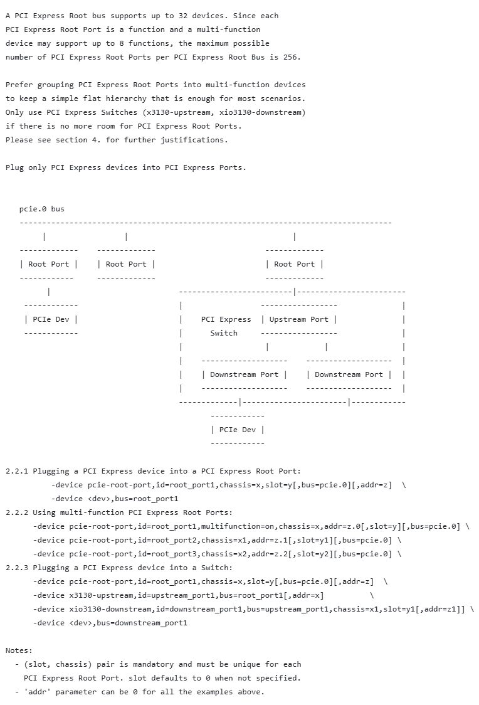

# Qemu PCI

### 1、qemu配置PCI

```shell
# 全部使用pcie-root-port
qemu-system-aarch64 -M virt,gic-version=3 -m 16G -cpu cortex-a72 -smp 4 \
    -kernel Image -append "console=ttyAMA0 nokaslr root=/dev/vda rw video=Virtual-1:1920x1080@60me" \
    -device pcie-root-port,bus=pcie.0,id=seat0,addr=1.0,chassis=1 \
    -device pcie-root-port,bus=pcie.0,id=seat1,addr=2.0,chassis=2 \
    -device pcie-root-port,bus=pcie.0,id=seat2,addr=3.0,chassis=3 \
    -device pcie-root-port,bus=pcie.0,id=seat3,addr=4.0,chassis=4 \
    -device pcie-root-port,bus=pcie.0,id=seat4,addr=5.0,chassis=5 \
    -device virtio-gpu-pci,bus=seat0 \
    -device qemu-xhci,bus=seat1 \
    -device edu,dma_mask=0xffffffffffffffff,bus=seat2 \
    -device e1000e,netdev=tap0,bus=seat3 -netdev tap,id=tap0,ifname=tap0,script=no,downscript=no \
    -device virtio-blk-pci,bus=seat4,drive=rootfs -blockdev driver=file,node-name=rootfs,filename=ubuntu22_arm64.img \
    -device usb-mouse -device usb-kbd -device usb-tablet \
    -monitor none -serial telnet::55555,server,nowait,nodelay -s
```



```shell
# 1、pcie-root-port，只能连接一个设备
# 2、xio3130-downstream、x3130-upstream：switch设备
# 3、bus使用pcie.0：Root Complex Integrated Endpoint
qemu-system-aarch64 -M virt,gic-version=3 -m 16G -cpu cortex-a72 -smp 4 \
    -kernel Image -append "console=ttyAMA0 nokaslr root=/dev/vda rw video=Virtual-1:1920x1080@60me" \
    -device pcie-root-port,bus=pcie.0,id=seat0,addr=1.0 \
    -device x3130-upstream,id=upstream_port1,bus=seat0 \
    -device xio3130-downstream,id=downstream_port1,bus=upstream_port1,chassis=1,slot=0 \
    -device xio3130-downstream,id=downstream_port2,bus=upstream_port1,chassis=1,slot=1 \
    -device xio3130-downstream,id=downstream_port3,bus=upstream_port1,chassis=1,slot=2 \
    -device xio3130-downstream,id=downstream_port4,bus=upstream_port1,chassis=1,slot=3 \
    -device virtio-gpu-pci,bus=downstream_port1 \
    -device qemu-xhci,bus=downstream_port2 \
    -device edu,dma_mask=0xffffffffffffffff,bus=downstream_port3 \
    -device e1000e,netdev=tap0,bus=downstream_port4 -netdev tap,id=tap0,ifname=tap0,script=no,downscript=no \
    -device virtio-blk-pci,bus=pcie.0,drive=rootfs,addr=2.0 -blockdev driver=file,node-name=rootfs,filename=ubuntu22_arm64.img \
    -device usb-mouse -device usb-kbd -device usb-tablet \
    -monitor none -serial stdio -s
```



```shell
# 使用pxb-pcie，只能直接接 root-port或pci-bridge，但是当前不生效
qemu-system-aarch64 -M virt,gic-version=3 -m 16G -cpu cortex-a72 -smp 4 \
    -kernel Image -append "console=ttyAMA0 nokaslr root=/dev/vda rw video=Virtual-1:1920x1080@60me" \
    -device pxb-pcie,id=pcie.1,bus=pcie.0,bus_nr=70 \
    -device pcie-root-port,bus=pcie.1,id=seat1,addr=1.0,chassis=1,slot=1 \
    -device pcie-root-port,bus=pcie.1,id=seat2,addr=2.0,chassis=2,slot=2 \
    -device pcie-root-port,bus=pcie.1,id=seat3,addr=3.0,chassis=3,slot=3 \
    -device pcie-root-port,bus=pcie.1,id=seat4,addr=4.0,chassis=4,slot=4 \
    -device qemu-xhci,bus=seat1 \
    -device edu,dma_mask=0xffffffffffffffff,bus=seat2 \
    -device e1000e,netdev=tap0,bus=seat3 -netdev tap,id=tap0,ifname=tap0,script=no,downscript=no \
    -device virtio-blk-pci,bus=seat4,drive=rootfs,addr=2.0 -blockdev driver=file,node-name=rootfs,filename=ubuntu22_arm64.img \
    -device usb-mouse -device usb-kbd -device usb-tablet \
    -monitor none -serial stdio -s
```

### 2、Qemu参考文档

- [Qemu PCIe文档](https://github.com/qemu/qemu/blob/master/docs/pcie.txt)





### 3、linux的mps的配置

```shell
# 0、核心接口
devm_pci_alloc_host_bridge
pci_bus_size_bridges
pci_bus_assign_resources
pcie_bus_configure_settings
pci_bus_add_devices

# root port没有上级的bridge，没有被设置过mps，用的是固件/硬件初始化的
# 1、bridge/dev 设置mps
pci_scan_root_bus_bridge/pci_scan_root_bus
 -> pci_scan_child_bus -> pci_scan_child_bus_extend 
    -> pci_scan_slot -> pci_scan_single_device
      -> pci_device_add -> pci_configure_device -> pci_configure_mps
      
   pcie_get_mps/pcie_set_mps
   
# 2、设备的DEVCAP_PAYLOAD_SIZE的获取
pci_scan_single_device -> pci_scan_device -> pci_setup_device 
  -> set_pcie_port_type
  pdev->pcie_mpss = FIELD_GET(PCI_EXP_DEVCAP_PAYLOAD, pdev->devcap);
  
# 3、扫链完成重新配置MAX_PAYLOAD_SIZE
pci_host_probe -> pcie_bus_configure_settings
# 1) pcie_find_smpss: pcie_bus_config == PCIE_BUS_SAFE，查询总线上所有设备DEVCAP最小的mps
# 2) pcie_bus_configure_set: pcie_bus_config!=PCIE_BUS_TUNE_OFF && pcie_bus_config!=PCIE_BUS_DEFAULT，设置总线上所有设备的mps和mrrs
# 3) pcie_bus_config == PCIE_BUS_PERFORMANCE并没有顾名思义
#    pcie_write_mps: pcie_bus_config==PCIE_BUS_PERFORMANCE 匹配设备的DEVCAP的mps和总线配置的mps的最小值，而不是整个链路上的最小值
#    pcie_write_mrrs: pcie_bus_config==PCIE_BUS_PERFORMANCE，尝试将设备配置的mps设置到mrrs.
```
