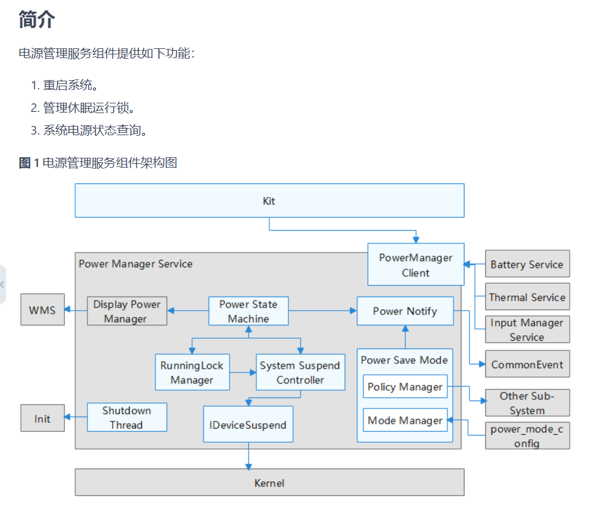
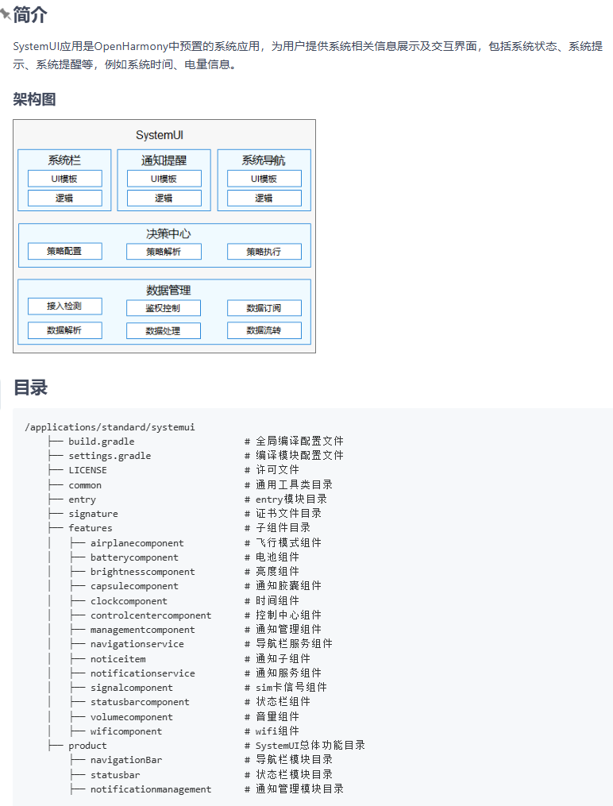

# power_dialog

### 1、整体架构



### 2、systemui

- 



### 3、电源管理弹窗

- 电源按键的监听、回调函数、dialog显示
- 按键状态：1) 短按按下 2) 短按弹起 3) 长按按下
- 长按：关机 / 重启
- 代码路径
  - base/powermgr/power_manager/services/native/src/shutdown/shutdown_dialog.cpp
  - base/powermgr/power_manager/services/native/src/wakeup/wakeup_controller.cpp
  - base/powermgr/power_manager/services/native/src/suspend/suspend_controller.cpp
  - power_ability: base/powermgr/power_manager/utils/ability/BUILD.gn
  - ​                        : base/powermgr/power_manager/utils/ability/power_ability.cpp
  - power_dialog: base/powermgr/power_manager/power_dialog/oh-package.json5
  - 

- 代码解析

  ```c++
  // long press powerkey
  base/powermgr/power_manager/services/native/src/shutdown/shutdown_dialog.cpp
  // 1) 解析配置
  std::string DIALOG_CONFIG_PATH = "etc/systemui/poweroff_config.json";
  std::string KEY_DOWN_DURATION = "const.powerkey.down_duration";
  std::string ShutdownDialog::bundleName_ = "com.ohos.powerdialog";
  std::string ShutdownDialog::abilityName_ = "PowerUiExtensionAbility";
  std::string ShutdownDialog::dialogBundleName_ = "com.ohos.systemui";
  std::string ShutdownDialog::dialogAbilityName_ = "com.ohos.systemui.dialog";
  
  ShutdownDialog::LoadDialogConfig -> ShutdownDialog::ParseJsonConfig
      "bundleName"
      "abilityName"
      "uiExtensionType"
  
  // 2) 监听电源按钮事件
  ShutdownDialog::KeyMonitorInit -> ShutdownDialog::StartDialog
      keyOption->SetFinalKey(KeyEvent::KEYCODE_POWER);
      keyOption->SetFinalKeyDown(true);
      SysParam::GetIntValue(KEY_DOWN_DURATION, LONG_PRESS_DELAY_MS);
      keyOption->SetFinalKeyDownDuration(downDuration);
      auto inputManager = InputManager::GetInstance();
      inputManager->SubscribeKeyEvent(keyOption, [this](std::shared_ptr<KeyEvent> keyEvent) {
          StartDialog
              // sptr<OHOS::AAFwk::IAbilityConnection> dialogConnectionCallback_ {nullptr}; 
              // 连接之后，会回调dialogConnectionCallback_->OnAbilityConnectDone(ShutdownDialog::DialogAbilityConnection::OnAbilityConnectDone)
              -> ShutdownDialog::ConnectSystemUi
              -> ShutdownDialog::StartVibrator
      }
  
  // 3) 连接systemui
  ShutdownDialog::ConnectSystemUi
      want.SetElementName(dialogBundleName_, dialogAbilityName_);
      dlopen("libpower_ability.z.so", RTLD_NOW | RTLD_NODELETE);
      dlsym(handler, "PowerConnectAbility")
      powerConnectAbility(want, dialogConnectionCallback_, INVALID_USERID);
  
  // 4) power ablility动态库: base/powermgr/power_manager/utils/ability/power_ability.cpp
  PowerConnectAbility
      auto amsClient = AbilityManagerClient::GetInstance();
      result = amsClient->ConnectAbility(want, connect, userId);
  
  // 5) ability回调实现
  foundation/ability/ability_runtime/test/new_test/mock/ability_connect_callback_interface/ability_connect_callback_interface.h
      class IAbilityConnection : public IRemoteBroker {
          OnAbilityConnectDone();
          OnAbilityDisconnectDone();
      };
  
  // 6) 显示power_diag: ability回调，拉起 (com.ohos.powerdialog, PowerUiExtensionAbility)
  ShutdownDialog::DialogAbilityConnection::OnAbilityConnectDone
  	FFRTUtils::SubmitTask([remoteObject] {
          MessageParcel data;
          data.WriteString16(u"bundleName");
          data.WriteString16(Str8ToStr16(ShutdownDialog::GetBundleName()));  // com.ohos.powerdialog
          data.WriteString16(u"abilityName");
          data.WriteString16(Str8ToStr16(ShutdownDialog::GetAbilityName())); // PowerUiExtensionAbility
          data.WriteString16(u"parameters");
          const uint32_t cmdCode = 1;
          remoteObject->SendRequest(cmdCode, data, reply, option);
          auto pms = DelayedSpSingleton<PowerMgrService>::GetInstance();
          pms->RefreshActivityInner(static_cast<int64_t>(time(nullptr)), UserActivityType::USER_ACTIVITY_TYPE_ATTENTION, false);
      };
          
  foundation/ability/ability_runtime/frameworks/native/ability/ability_runtime/connection_manager.cpp
      ConnectionManager::ConnectAbility -> ConnectionManager::ConnectAbilityInner -> connectCallback.OnAbilityConnectDone
  
  // 7) 弹窗代码: base/powermgr/power_manager/power_dialog/oh-package.json5
  //         base/powermgr/power_manager/power_dialog/entry/src/main/ets/pages/powerDialog.ets
      PowerCustomDialog::shutdown -> PowerDialog::onShutdown -> power.shutdown('power_dialog');
      PowerCustomDialog::reboot -> PowerDialog::onReboot -> power.reboot('power_dialog');
      // 背景颜色配置: default_background_color
      base/powermgr/power_manager/power_dialog/entry/src/main/resources/base/element/color.json
  ```

### 4、熄屏和亮屏

- WakeupController：熄屏状态下，唤醒屏幕

  - **事件捕获**：用户在熄屏状态下按下电源键，监听电源按键弹起事件。
  - **唤醒源**：管理的“唤醒源”列表中包含了电源键。
  - **执行唤醒**：执行唤醒流程，点亮屏幕，将系统从低功耗状态恢复正常运行。

- ###### SuspendController：亮屏状态下，熄屏

  - **事件捕获**：用户在亮屏时按下电源键，监听电源按键按下事件。
  - **执行熄屏和休眠**：`PowerMgrService` 调用显示服务熄灭屏幕。`SuspendController` 介入，在系统一段时间无活动时，让系统进入低功耗的挂起（Suspend）状态，以节省电量

- wakeup

  ```c++
  base/powermgr/power_manager/services/native/src/wakeup/wakeup_controller.cpp
      PowerkeyWakeupMonitor::Init
      	std::shared_ptr<OHOS::MMI::KeyOption> keyOption = std::make_shared<OHOS::MMI::KeyOption>();
          keyOption->SetFinalKey(OHOS::MMI::KeyEvent::KEYCODE_POWER);
          keyOption->SetFinalKeyDown(true);
          keyOption->SetFinalKeyDownDuration(0);
          auto inputManager = InputManager::GetInstance();
  		inputManager->SubscribeKeyEvent(keyOption, keyEvent) 
              ReceivePowerkeyCallback();
  				 poweroffInterrupted = stateMachine->TryToCancelScreenOff();
  ```

- suspend

  ```c++
  base/powermgr/power_manager/services/native/src/suspend/suspend_controller.cpp
      PowerKeySuspendMonitor::Init
      	std::shared_ptr<OHOS::MMI::KeyOption> keyOption = std::make_shared<OHOS::MMI::KeyOption>();
          keyOption->SetFinalKey(OHOS::MMI::KeyEvent::KEYCODE_POWER);
          keyOption->SetFinalKeyDown(false);
          keyOption->SetFinalKeyDownDuration(0);
          auto inputManager = InputManager::GetInstance();
  		inputManager->SubscribeKeyEvent(keyOption, keyEvent)
          	ReceivePowerkeyCallback();
  				BeginPowerkeyScreenOff();
  ```

  