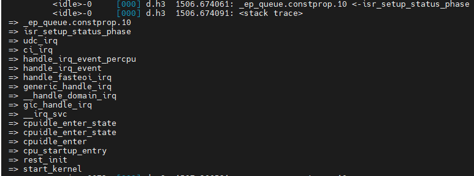

# ftrace

### 1、使能ftrace

```shell
# 配置路径
linux/kernel/trace/Kconfig
CONFIG_FTRACE
CONFIG_FUNCTION_TRACER
CONFIG_FUNCTION_GRAPH_TRACER

# 确认ftrace使能路径
/sys/kernel/debug/tracing
```

### 2、使用

```shell
# 查看指定函数的调用栈
# 必须先关掉 tracing_on和func_stack_trace，启动前必须指定过滤的函数，否则 func_stack_trace会打印所有函数调用，导致系统卡死
echo 0 > /sys/kernel/debug/tracing/tracing_on
echo 0 > /sys/kernel/debug/tracing/options/func_stack_trace  # 新内核

# 查看支持的过滤器
cat /sys/kernel/debug/tracing/available_tracers
# 指定使用的过滤器
echo function > /sys/kernel/debug/tracing/current_tracer
# 指定要查看调用栈的函数，指定的函数必须在 available_filter_functions
echo _ep_queue.constprop.10 > /sys/kernel/debug/tracing/set_ftrace_filter
# 指定多个函数
# echo _hardware_enqueue >> /sys/kernel/debug/tracing/set_ftrace_filter

# 使能查看函数调用栈
echo 1 > /sys/kernel/debug/tracing/options/func_stack_trace  # 新内核
# 启动trace
echo 1 > /sys/kernel/debug/tracing/tracing_on

# 实时查看函数调用栈
cat /sys/kernel/debug/tracing/trace_pipe

# 关闭trace
echo 0 > /sys/kernel/debug/tracing/tracing_on
```

