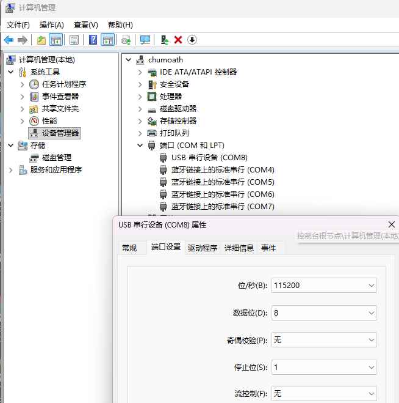
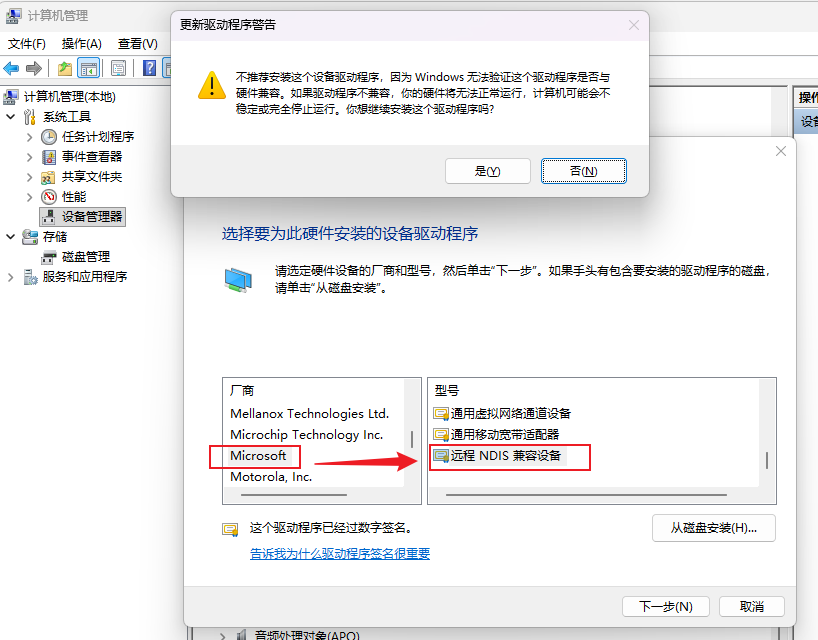
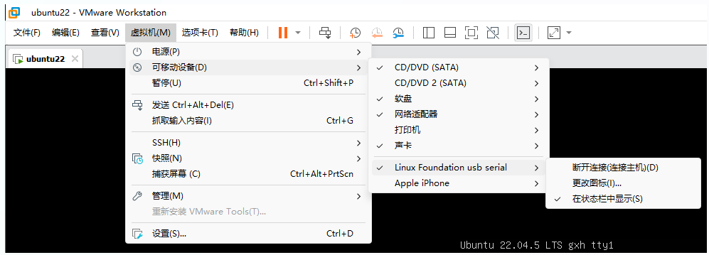
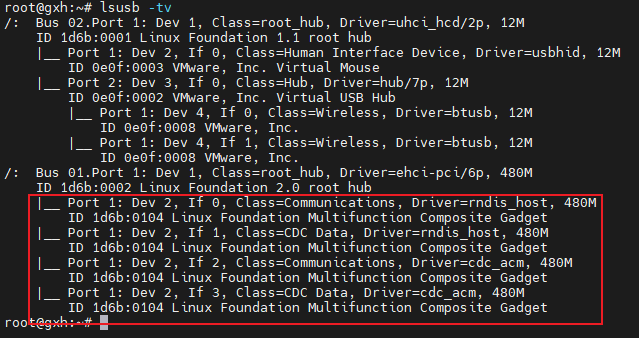
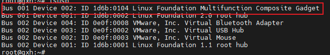
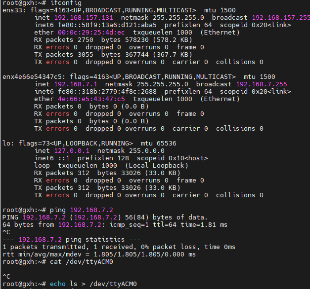
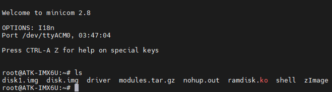

# imx6ull

### 1、编译linux内核

```shell
# 内核出厂源码
git clone https://gitee.com/GuangzhouXingyi/linux-imx-4.1.15-2.1.0.git

# 编译工具链
https://github.com/juan-gutierrez-nxp/poky_sdk/blob/master/fsl-imx-x11-glibc-x86_64-meta-toolchain-cortexa7hf-neon-toolchain-4.9.11-1.0.0.sh

# 环境准备：ubuntu22.04的gcc版本过高，不能编译 4.1.15内核的dtc
docker run -it -v /root:/root ubuntu:18.04
apt update
apt install -y xz-utils python3 make gcc bison vim bc libncurses5-dev lzop

# 安装编译工具链
./fsl-imx-x11-glibc-x86_64-meta-toolchain-cortexa7hf-neon-toolchain-4.9.11-1.0.0.sh

# 编译内核和ko
source /opt/fsl-imx-x11/4.9.11-1.0.0/environment-setup-cortexa7hf-neon-poky-linux-gnueabi
make distclean
make imx_v7_defconfig

# 打开 FTRACE
make menuconfig
make zImage -j$(nproc)

# 编译设备树
make imx6ull-14x14-emmc-4.3-480x272-c.dtb

# 使用 configfs.ko
make modules -j$(nproc)
make modules_install INSTALL_MOD_PATH=tmp

# 打包
tar -zcvf ./modules.tar.gz -C ./tmp .

# 部署到开发板
scp -o HostKeyAlgorithms=+ssh-rsa arch/arm/boot/zImage 192.168.3.30:/home/root/
scp -o HostKeyAlgorithms=+ssh-rsa modules.tar.gz  192.168.3.30:/home/root/

# 替换内核
mv /run/media/mmcblk1p1/zImage /run/media/mmcblk1p1/zImage.bak
cp /home/root/zImage   /run/media/mmcblk1p1/

# 安装ko
tar -xf /home/root/modules.tar.gz -C /
depmod -a
```

### 2、使用configfs创建gadget

```shell
# 前提：PC连接到开发板的OTG
# 使用configfs
modprobe configfs

# 挂载configfs文件系统 - 初始目录为空
mount -t configfs none /sys/kernel/config

# 加载libcomposite模块，创建/sys/kernel/config/usb_gadget 目录
modprobe libcomposite

# 创建gadget
cd /sys/kernel/config/usb_gadget

# 1) 创建名为 g1的gadget设备
mkdir g1 && cd g1

# 2) 配置设备描述符
# 设置 USB 厂商 ID 和设备 ID
echo 0x1d6b > idVendor
echo 0x0104 > idProduct

# 设置设备描述信息
mkdir strings/0x409
echo "1234567890" > strings/0x409/serialnumber
echo "chumoath" > strings/0x409/manufacturer
echo "usb serial" > strings/0x409/product

# 3) 创建一个配置（c 表示 config，1 是配置编号）
mkdir configs/c.1
echo 100 > configs/c.1/MaxPower  # 单位是 mA

# 为配置添加英文描述
mkdir configs/c.1/strings/0x409
echo "MyConfig" > configs/c.1/strings/0x409/configuration

# 4) 创建串口功能（ACM 即 Abstract Control Model，通用串口）- 会自动加载 usb_f_acm u_serial 模块
mkdir functions/acm.GS0   # “acm.”为功能名，后接自定义实例名

# 5) 将功能链接到配置
ln -s functions/acm.GS0 configs/c.1/acm.GS0

# 6) 将 gadget 绑定到 UDC，激活设备
# 查看可用的 UDC
ls /sys/class/udc/
# 示例输出：ci_hdrc.0

echo "ci_hdrc.0" > /sys/kernel/config/usb_gadget/g1/UDC

# 4) 停用 gadget
echo "" > /sys/kernel/config/usb_gadget/g1/UDC
```

### 3、USB gadget串口配置

```shell
# ACM - 在ttyGS0运行shell，PC侧会自动协商波特率；getty设置的多少，就会协商到多少
#     - 驱动 u_serial usb_f_acm
/etc/inittab
GS0:12345:respawn:/sbin/getty -l /bin/autologin -n -L 115200 ttyGS0

# 修改后重启开发板，一直运行 getty
```



### 3、USB gadget网络配置

```shell
# rndis - 网络，ECM 网络不能使用，所有网络全都是使用 drivers/usb/gadget/function/u_ether.c 的 gether_connect
#       - 驱动：u_ether  usb_f_rndis

echo "" > /sys/kernel/config/usb_gadget/g1/UDC

mkdir /sys/kernel/config/usb_gadget/g1/functions/rndis.usb0   # “rndis.”为功能名，后接自定义实例名
ln -s /sys/kernel/config/usb_gadget/g1/functions/rndis.usb0 /sys/kernel/config/usb_gadget/g1/configs/c.1/rndis.usb0

echo "ci_hdrc.0" > /sys/kernel/config/usb_gadget/g1/UDC

# windows网络配置： 
其他设备 -> CDC ECM(带感叹号) -> 右键 -> 更新驱动程序 -> 浏览我的电脑以查找驱动程序
   -> 让我从计算机上的可用驱动列表中选取 -> 网络适配器 -> Microsoft -> 远程NDIS兼容设备 -> 强制安装
```



### 4、USB gadget存储设备配置

```shell
# mass_storage: 块设备
#       - 驱动：usb_f_mass_storage

echo "" > /sys/kernel/config/usb_gadget/g1/UDC

# 创建存储镜像文件（大小为 64MB，可自行调整）
dd if=/dev/zero of=/tmp/disk.img bs=1M count=64
mkfs.vfat /tmp/disk.img  # 格式化为 FAT32

# 创建功能并挂载镜像
mkdir /sys/kernel/config/usb_gadget/g1/functions/mass_storage.0
echo /tmp/disk.img > /sys/kernel/config/usb_gadget/g1/functions/mass_storage.0/lun.0/file
ln -s /sys/kernel/config/usb_gadget/g1/functions/mass_storage.0 /sys/kernel/config/usb_gadget/g1/configs/c.1/mass_storage.0

# 使能gadget
echo "ci_hdrc.0" > /sys/kernel/config/usb_gadget/g1/UDC
```

### 5、USB gadget multifunction

```shell
# 一个USB gadget支持多个function，即多个接口描述符：网络、串口、U盘
#   - U盘和网络不能同时出现，同时出现 windows上的网络接口有驱动也无法启动
#   - 拓扑结构可以放到 vmware里面看

# 创建存储镜像文件（大小为 64MB，可自行调整）
dd if=/dev/zero of=/tmp/disk.img bs=1M count=64
mkfs.vfat /tmp/disk.img  # 格式化为 FAT32

# U盘
mkdir /sys/kernel/config/usb_gadget/g1/functions/mass_storage.0
echo /tmp/disk.img > /sys/kernel/config/usb_gadget/g1/functions/mass_storage.0/lun.0/file
ln -s /sys/kernel/config/usb_gadget/g1/functions/mass_storage.0 /sys/kernel/config/usb_gadget/g1/configs/c.1/mass_storage.0

# 网络
mkdir /sys/kernel/config/usb_gadget/g1/functions/rndis.usb0
ln -s /sys/kernel/config/usb_gadget/g1/functions/rndis.usb0 /sys/kernel/config/usb_gadget/g1/configs/c.1/rndis.usb0

# 串口
mkdir /sys/kernel/config/usb_gadget/g1/functions/acm.GS0
ln -s /sys/kernel/config/usb_gadget/g1/functions/acm.GS0 /sys/kernel/config/usb_gadget/g1/configs/c.1/acm.GS0
```









