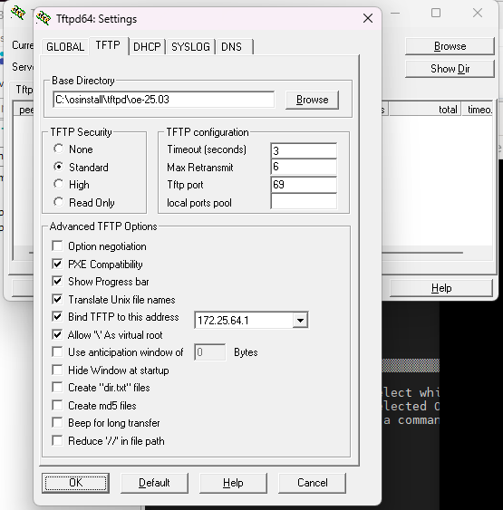
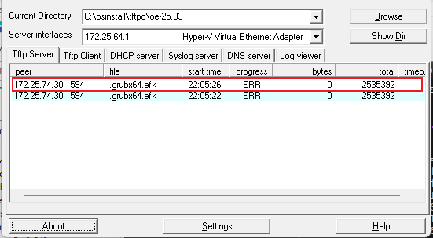
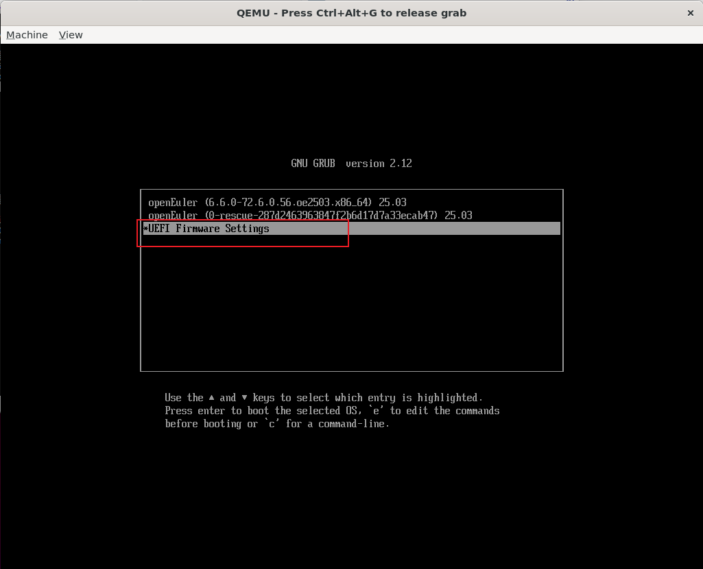
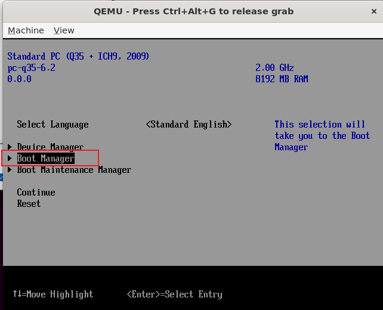
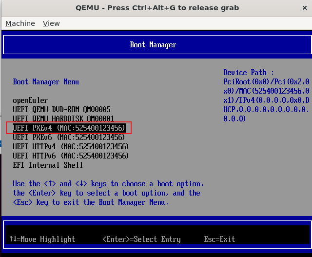

# pxe安装openeuler

# 一、准备openeuler的OS镜像

- 下载openeuler的ISO: [openEuler25.03](https://www.openeuler.openatom.cn/zh/download/archive/detail/?version=openEuler%2025.03)
- 创建目录

```shell
# windows:
  # http:
      iso/* => C:\osinstall\oe-25.03\
  # tftp:
  	  iso/images/pxeboot/vmlinuz    => C:\osinstall\tftpd\oe-25.03\
  	  iso/images/pxeboot/initrd.img => C:\osinstall\tftpd\oe-25.03\
  	  iso/EFI/BOOT/grubx64.efi      => C:\osinstall\tftpd\oe-25.03\
  	  iso/EFI/BOOT/grub.cfg         => C:\osinstall\tftpd\oe-25.03\
  	  
# linux:
  # http:
  	  iso/* => /srv/http/oe-25.03/
  # tftp:
  	  iso/images/pxeboot/vmlinuz    => /srv/tftp/
  	  iso/images/pxeboot/initrd.img => /srv/tftp/
  	  iso/EFI/BOOT/grubx64.efi      => /srv/tftp/
  	  iso/EFI/BOOT/grub.cfg         => /srv/tftp/
```

# 二、同一子网PXE启动

- DHCP、TFTP、HTTP都部署在linux，且和qemu在同一子网
- 为什么不能用wireguard? 必须使用dhcp分配IP，guest必须和DHCP服务器在同一个网段，但wireguard没有DHCP功能。可以使用带DHCP功能的VPN软件。

### 0、Qemu运行

```shell
# 1) 创建硬盘
qemu-img create -f qcow2 openeuler25.03.qcow2 40G
# UEFI and grub密码: root/openEuler#12

# 2) 配置网络
ip tuntap add tap0 mode tap group 0
ip link set dev tap0 up
ip addr add 192.168.33.1/24 dev tap0
iptables -A POSTROUTING -t nat -j MASQUERADE -s 192.168.33.0/24
echo 1 > /proc/sys/net/ipv4/ip_forward
iptables -P FORWARD ACCEPT

# 3) 启动qemu
qemu-system-x86_64 -M q35 -cpu max -m 8G -smp 8 -boot n -enable-kvm \
-bios /usr/share/OVMF/OVMF_CODE.fd -serial stdio \
-device e1000e,netdev=tap0 \
-netdev tap,id=tap0,ifname=tap0,script=no,downscript=no \
-hda openeuler25.03.qcow2

# 4) error: ../../grub-core/loader/i386/efi/linux.c:222:you need to load the kernel first.
# qemu启动必须指定 -m，否则内存不足
```

### 1、DHCP服务

- 广播到UDP 255.255.255.255:67，分配IP

```shell
# 1) 安装dhcp服务
apt install -y isc-dhcp-server

# 2) 配置dhcp
# /etc/dhcp/dhcpd.conf
subnet 192.168.33.0 netmask 255.255.255.0 {
	range 192.168.33.2 192.168.33.200;
	option routers 192.168.33.1;
	# tftp server ip
	next-server 192.168.33.1;
	filename "grubx64.efi";
}

systemctl restart isc-dhcp-server
```

### 2、tftp服务

```shell
# 1) 安装tftp服务
apt install -y tftpd-hpa

# 2) 配置tftp
# /etc/default/tftpd-hpa
TFTP_USERNAME="tftp"
TFTP_DIRECTORY="/srv/http"
TFTP_ADDRESS=":69"
TFTP_OPTIONS="--secure"

# 3) 准备tftp文件
# /srv/tftp
- vmlinuz           # iso/images/pxeboot/vmlinuz
- initrd.img        # iso/images/pxeboot/initrd.img
- grubx64.efi       # iso/EFI/BOOT/grubx64.efi
- grub.cfg

# 4) 启动tftpd服务
systemctl restart tftpd-hpa.service
```

### 3、http服务

```shell
# 1) 解压iso至该目录 - openEuler-25.03-x86_64-dvd.iso
/srv/http/oe-25.03/

# 2) 启动http服务
python3 -m http.server -d /srv/http/ 8080 &
```

### 4、tftp-grub.cfg

- grub tftp的替代命令: linuxefi 和 initrdefi 使用 tftp，即和 grubx64.efi 相同的获取方式
  - 像使用硬盘一样，必须使用绝对路径
  - `set root=(tftp,192.168.33.1)`
  - `linux /vmlinuz fpi_to_tail=off inst.geoloc=0 inst.ks=http://192.168.33.1:8080/oe-25.03/ks/oe-2503.cfg console=ttyS0 console=tty0`
  - `initrd /initrd.img`

```shell
# /srv/tftp/grub.cfg
set default="0"

function load_video {
  insmod efi_gop
  insmod efi_uga
  insmod video_bochs
  insmod video_cirrus
  insmod all_video
}

load_video
set gfxpayload=keep
insmod gzio
insmod part_gpt
insmod ext2

set timeout=60
### END /etc/grub.d/00_header ###

search --no-floppy --set=root -l 'openEuler-25.03-x86_64'

### BEGIN /etc/grub.d/10_linux ###
menuentry 'Install openEuler 25.03' --class openEuler --class gnu-linux --class gnu --class os {
        linuxefi vmlinuz fpi_to_tail=off inst.geoloc=0 inst.ks=http://192.168.33.1:8080/oe-25.03/ks/oe-2503.cfg console=ttyS0 console=tty0
        initrdefi initrd.img
}
menuentry 'Test this media & install openEuler 25.03' --class openEuler --class gnu-linux --class gnu --class os {
        linuxefi /images/pxeboot/vmlinuz inst.stage2=hd:LABEL=openEuler-25.03-x86_64 rd.live.check fpi_to_tail=off
        initrdefi /images/pxeboot/initrd.img
}
submenu 'Troubleshooting -->' {
        menuentry 'Install openEuler 25.03 in basic graphics mode' --class openEuler --class gnu-linux --class gnu --class os {
                linuxefi /images/pxeboot/vmlinuz inst.stage2=hd:LABEL=openEuler-25.03-x86_64 nomodeset fpi_to_tail=off
                initrdefi /images/pxeboot/initrd.img
        }
        menuentry 'Rescue a openEuler system' --class openEuler --class gnu-linux --class gnu --class os {
                linuxefi /images/pxeboot/vmlinuz inst.stage2=hd:LABEL=openEuler-25.03-x86_64 inst.rescue fpi_to_tail=off
                initrdefi /images/pxeboot/initrd.img
        }
}
```

### 5、ks配置

```shell
# /srv/http/oe-25.03/ks/oe-2503.cfg
ignoredisk --only-use=sda

# System bootloader configuration 
bootloader --location=mbr --boot-drive=sda

# Partition clearing information
clearpart --all --initlabel --drives=sda

# Partition information
# autopart --type=lvm
part /boot/efi --fstype=efi  --size=600  --ondisk=sda
part /boot     --fstype=ext4 --size=1024 --ondisk=sda
# 此处含义为使用sda所有剩余空间
part pv.01 --size=1 --grow --ondisk=sda
volgroup openeuler_chumoath pv.01

logvol /     --fstype=ext4 --name=root --vgname=openeuler_chumoath --size=10240
logvol swap  --fstype=swap --name=swap --vgname=openeuler_chumoath --size=4096
# 此处含义为使用使用该卷所有剩余空间
logvol /home --fstype=ext4 --name=home --vgname=openeuler_chumoath --size=1 --grow

# Use text mode install
text

# Firewall configuration
firewall --disabled

# Use network installation
url --url="http://192.168.33.1:8080/oe-25.03"

# Keyboard layouts
keyboard --vckeymap=us --xlayouts='us'

# System language
lang en_US.UTF-8

# Network information
# 网口必须正确，否则reboot后无法正确设置密码
network --bootproto=static --device=enp0s2 --ip=192.168.33.2 --netmask=255.255.255.0 --ipv6=auto --activate
network --hostname=chumoath

# Reboot after installation
reboot

# Root password
rootpw --plaintext gxh

# Run the Setup Agent on first boot
firstboot --enable

# SELinux configuration
selinux --disabled

# Do not configure the X Window System
skipx

# System services
services --enabled="chronyd"

# System timezone
timezone Asia/Shanghai --utc

%packages
@^server-product-environment
@development
@network-server
@system-tools

chrony
gdb
telnet
i2c-tools
kernel-devel

%end
%addon com_redhat_kdump --enable --reserve-mb='auto'
%end
```

### 25.03 /init error

- glibc error: cpu does not support x86-64-v2: `使用 -cpu max，使用全量的host cpu特性`

# 三、不同子网PXE启动

- DHCP部署在linux，且和qemu在同一子网；TFTP、HTTP在windows，和qemu不在同一个子网
- 过程抓包：`tcpdump -i tap0`

### 1、DHCP服务 - linux
- 修改 next-server 即可
```shell
# 1) 安装dhcp服务
apt install -y isc-dhcp-server
# 2) 配置dhcp
# /etc/dhcp/dhcpd.conf
subnet 192.168.33.0 netmask 255.255.255.0 {
	range 192.168.33.2 192.168.33.200;
	option routers 192.168.33.1;
	# tftp server ip
	next-server 172.25.64.1;
	filename "grubx64.efi";
}
```

### 2、HTTP服务 - windows

- windows启动http服务

```shell
python -m http.server --directory C:\osinstall  8080
```

- ks修改 - **配置网关 + 修改HTTP的IP**

```shell
# C:\osinstall\oe-25.03\ks\oe-2503.cfg
# 网口必须正确，否则reboot后无法正确设置密码

# Use network installation
url --url="http://172.25.64.1:8080/oe-25.03"

# 非同一网段必须添加网关，否则会卡在 check storage
network --bootproto=static --device=enp0s2 --ip=192.168.33.2 --netmask=255.255.255.0 --gateway=192.168.33.1 --ipv6=auto --activate
```

### 3、TFTP服务 - windows

- 使用tftpd64.exe - 配置后重启生效，重启后修改目录和网口即可



- wsl TFTP的NAT配置

```shell
# tftp协议 client使用 NAT 转发，转发的主机必须配置，否则获取文件报错
modprobe nf_nat_tftp
iptables -t raw -I PREROUTING -j CT -p udp -m udp --dport 69 --helper tftp
```



- 已安装openeuler的系统从PXE启动 - UEFI和grub的用户名和密码: `root/openEuler#12`





- C:\osinstall\tftpd\oe-25.03\grub.cfg - **修改http的IP**

  ```shell
  
  ### BEGIN /etc/grub.d/10_linux ###
  menuentry 'Install openEuler 25.03' --class openEuler --class gnu-linux --class gnu --class os {
          linuxefi vmlinuz fpi_to_tail=off inst.geoloc=0 inst.ks=http://172.25.64.1:8080/oe-25.03/ks/oe-2503.cfg console=ttyS0 console=tty0
          initrdefi initrd.img
  }
  ```
