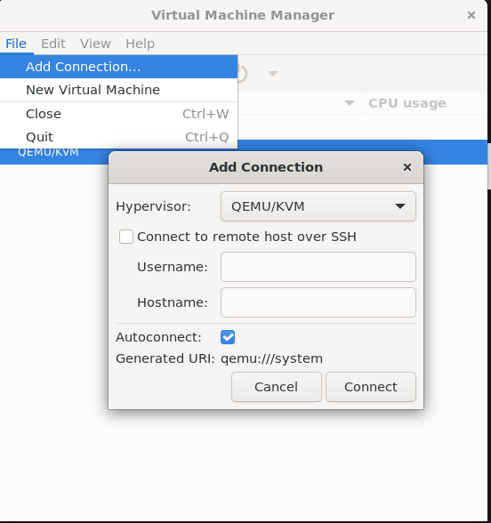
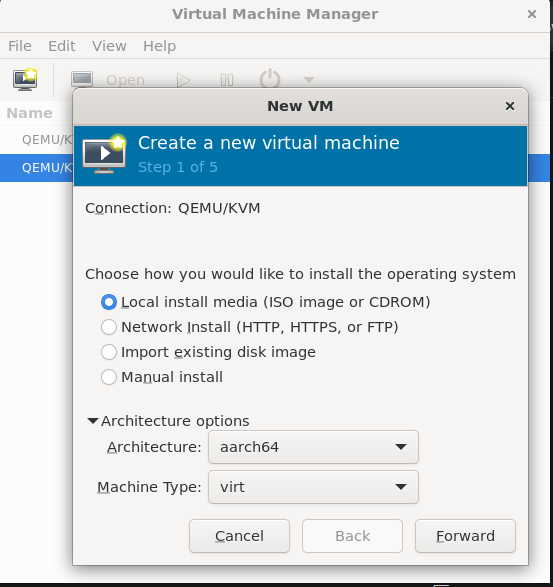
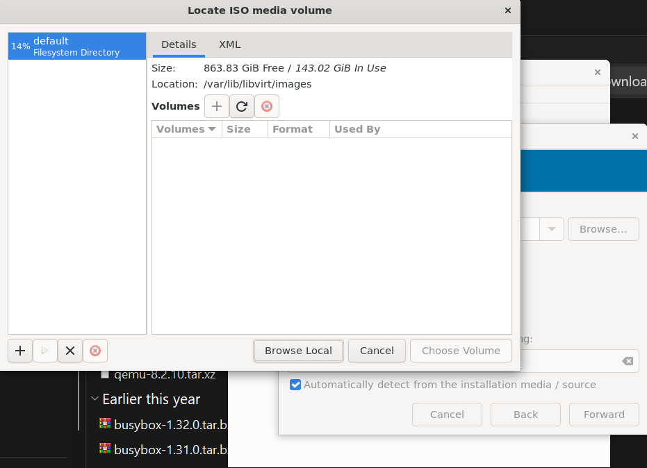
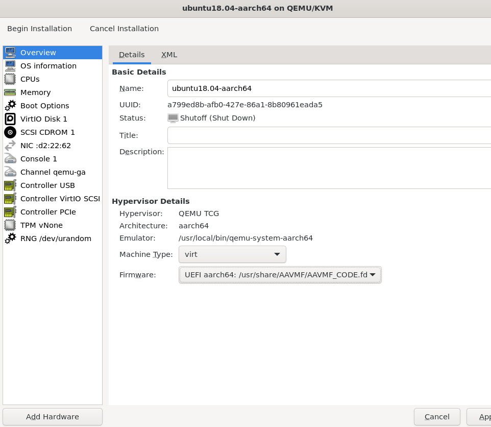
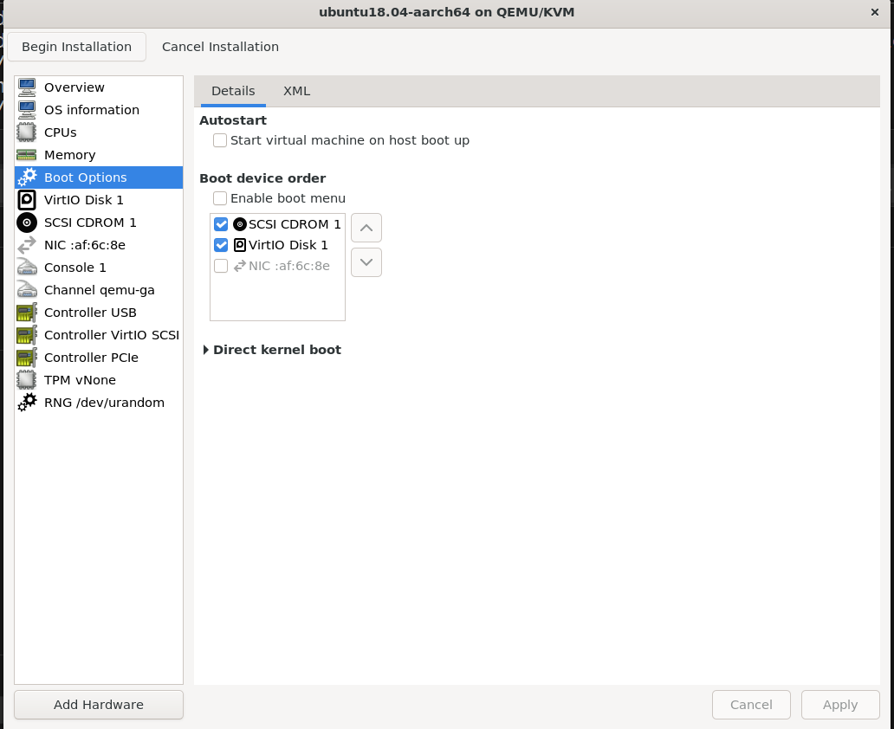
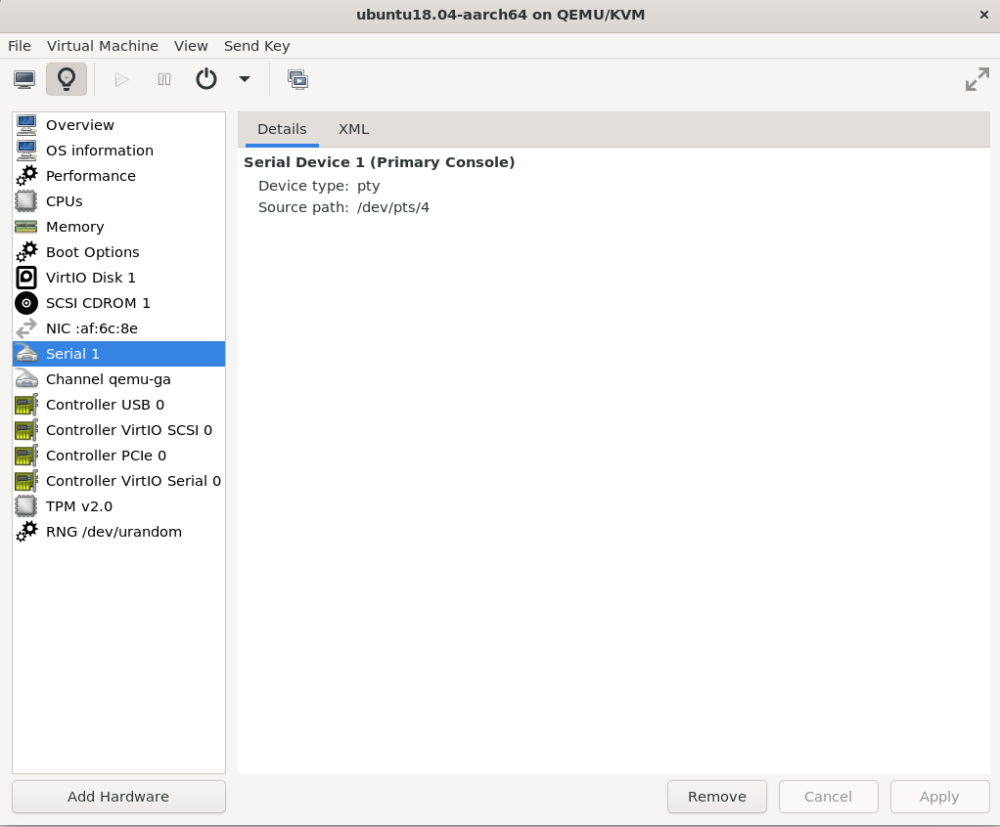

# libvirt_aarch64

### 一、overview

- 使用 virt-manager安装ubuntu-arm64 18.04，并替换BIOS

### 二、host安装

```shell
apt install -y virt-manager qemu-system-aarch64 qemu-efi-aarch64 gcc-aarch64-linux-gnu python3 iasl
ln -sf /usr/bin/python3 /usr/bin/python
```

### 三、edk2 aarch64构建

```shell
# 拉取所有代码
git clone https://github.com/tianocore/edk2.git
git clone https://github.com/tianocore/edk2-platforms.git
git clone https://github.com/tianocore/edk2-libc.git
git clone https://github.com/tianocore/edk2-non-osi.git
git clone https://git.linaro.org/uefi/uefi-tools.git
cd edk2
git submodule update --init
# 切换到稳定分支
git checkout -b gxh_dev edk2-stable202208

cd -
# 配置工作目录
vim uefi-tools/edk2-build.sh
WORKSPACE=`pwd`
EDK2_DIR=$WORKSPACE/edk2
PLATFORMS_DIR=$WORKSPACE/edk2-platforms
NON_OSI_DIR=$WORKSPACE/edk2-non-osi

# 构建 armvirtqemu64
./uefi-tools/edk2-build.sh armvirtqemu64  -b DEBUG

# 验证生成件
mkdir filedir
#qemu命令
qemu-system-aarch64 -machine virt,kernel_irqchip=on,gic-version=3 -cpu cortex-a57 -m 1G -device virtio-gpu-pci -drive file=fat:rw:./filedir/,media=disk,if=virtio,format=raw -nodefaults  -device qemu-xhci -device usb-kbd -bios `pwd`/Build/ArmVirtQemu-AARCH64/DEBUG_GCC5/FV/QEMU_EFI.fd -serial stdio

# Displays or defines file system mappings.
(uefi) map
# 进入 FAT 文件系统
(uefi) fs0:
```

### 四、下载ubuntu-arm64 18.04镜像

- [ubuntu-arm64](https://mirrors.tuna.tsinghua.edu.cn/ubuntu-cdimage/ubuntu/releases/18.04/release/)

### 五、安装虚拟机

```shell
virt-manager
```

- 添加connection



- 选择aarch64

  

- 选择iso

  

- 选择uefi

  

- 修改 bootorder

  

- 虚拟机运行后查看 串口的pty

  

- 虚拟机关闭 安全启动

### 六、修改BIOS

```shell
cp -fa /root/edk2/Build/ArmVirtQemu-AARCH64/DEBUG_GCC5/FV/QEMU_EFI.fd /
# 修改固件大小
qemu-img resize -f raw /QEMU_EFI.fd 64M

# 修改虚拟机的BIOS
virsh list --inactive
virsh list
virsh edit ubuntu18.04-aarch64
# <loader readonly='yes' type='pflash'>/usr/share/AAVMF/AAVMF_CODE.fd</loader>
改为
# <loader readonly='yes' type='pflash'>/QEMU_EFI.fd</loader>

# 其他virsh命令
virsh start ubuntu18.04-aarch64 --console

# 启动网络
virsh net-start --network default
```

- 注意：
  1. 权限问题: QEMU_EFI.fd 要放到整个目录都是root权限，不要放到 /home/xxx
  2. 文件大小问题: flash为64M，转换命令: `qemu-img resize -f raw /QEMU_EFI.fd 64M`

### 七、参考链接

- [aarch64 edk2 virt-manager](https://www.cnblogs.com/rayuu/p/17684176.html)