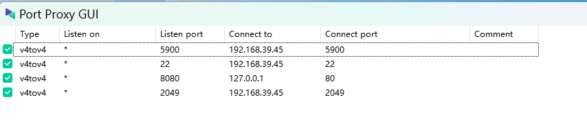

# nfs_forward

## 在wsl配置nfs服务，通过windows端口转发
- 概述
    1. nfs依赖的ko: `fscache.ko grace.ko lockd.ko nfs.ko nfs_acl.ko nfsv3.ko sunrpc.ko`
    
    2. nfs转发:
    
       - PPGUI/sockit 转发 windows 的 TCP 2049 端口到 WSL的 IP:2049即可
       
         
       
       - wsl配置nfs权限，使用: `/etc/exports` => `/nfs *(rw,sync,no_subtree_check,insecure)`
       
       - `mount.nfs4 10.21.205.129:/nfs /root/nfs`
       
    3. windows防火墙打开入站、出站所有端口
    
       
    
    4. 查看 nfs 服务: `nmap -Pn [windows IP]`
    
       
    
- 详细配置流程

## 在docker配置nfs服务