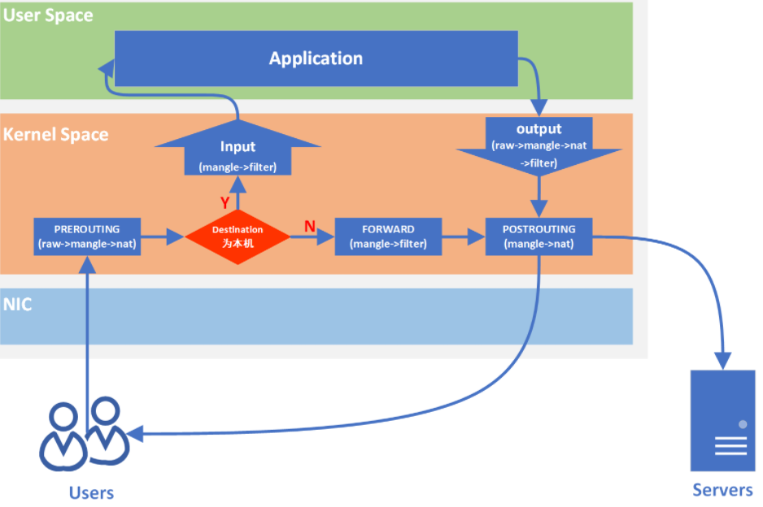

# vm_forward_topology

## 搭建用qemu调试ip_foward的网络拓扑结构

- 概述

  - veth pair通常用于连接不同的网络命令空间
  - tap
  - `net.ipv4.ip_forward=1`    `sysctl -p`   =  `/proc/sys/net/ipv4/ip_forward`
  
- 基础命令

  ```shell
  # 创建新的网络空间
  ip netns add ns-qemu
  
  # 查看网络空间
  ip netns list
  
  # 删除网络空间
  ip netns del ns-qemu
  
  # 创建 veth 对，并将该端 veth 移入网络命名空间
  ip link add veth-qemu type veth peer name veth-host
  ip link set veth-qemu netns ns-qemu
  
  # 删除veth对，删除一端会自动删除另一端
  ip link set dev veth-host down
  ip link delete veth-host
  
  # 查看系统中所有的veth
  ip -o link show type veth
  
  # 查看 veth 的对端 index(peer_index)
  ethtool -S veth-host
  
  # 配置ns-qemu网络空间内的网络
  # ip netns exec ns-qemu [command] 进入网络空间执行命令
  ip netns exec ns-qemu ip addr add 192.168.33.2/24 dev veth-qemu
  ip netns exec ns-qemu ip link set veth-qemu up
  # 配置ns-qemu网络空间的默认网关
  ip netns exec ns-qemu ip route add default via 192.168.33.1
  # 在 ns-qemu 网络空间执行bash
  ip netns exec ns-qemu bash
  ping 192.168.33.1
  
  # 配置host网络
  ip addr add 192.168.33.1/24 dev veth-host
  ip link set veth-host up
  ```

- 拓扑结构

  ```shell
  # 拓扑: host <-> vm1, host x> vm2, vm1 <-> vm2
  # 目标：host -> vm1 -> vm2
  # 大网: 192.168.33.0/24 小网: 192.168.3.0/24
  
  # host-ns
  # 创建 ns-qemu 网络空间
  ip netns add ns-qemu
  # 创建veth对
  ip link add veth-qemu type veth peer name veth-host
  # 将该端放入 ns-qemu 网络空间
  ip link set veth-qemu netns ns-qemu
  # 配置host网络
  ip addr add 192.168.33.1/24 dev veth-host
  ip link set veth-host up
  # 同docker：让 ns-qemu 网络空间可以访问外网和 host 的其他子网，做NAT
  iptables -A POSTROUTING -t nat -j MASQUERADE -s 192.168.33.0/24
  
  # ns-qemu
  # 不需要配置iptables转发，因为vm1流量不被ns-qemu网络命名空间转发
  ip netns exec ns-qemu bash
  
  # br-ext
  # 接入网桥的 tap 可以不配置 IP，不需要通信
  # 创建br-ext网桥
  ip link add br-ext type bridge
  # 将访问外部网络的 veth-qemu 加入 br-ext 网桥
  ip link set veth-qemu master br-ext
  # 创建连接 vm1 的 tap0
  ip tuntap add tap0 mode tap group 0
  # 将 tap0 添加到 br-ext 网桥
  ip link set tap0 master br-ext
  
  # 配置 br-ext 网桥IP
  ip addr add 192.168.33.2/24 dev br-ext
  
  # 激活网口
  ip link set veth-qemu up
  ip link set tap0 up
  ip link set br-ext up
  
  # 配置默认网关 - 若 ns-qemu 不需要访问外网，不必配置
  ip route add default via 192.168.33.1
  
  # br-int - 不访问外网，不需要桥接访问外网的接口
  # 创建 br-int 网桥
  ip link add br-int type bridge
  
  # 创建连接 vm1  的tap1，加入到 br-int 网桥
  ip tuntap add tap1 mode tap group 0
  ip link set tap1 master br-int
  
  # 创建连接 vm2  的tap2，加入到 br-int 网桥
  ip tuntap add tap2 mode tap group 0
  ip link set tap2 master br-int
  
  # 配置 br-int 网桥IP
  # - 需判断网桥不配IP，vm1 和 vm2 能否通过 tap1 和 tap2 ping 通；
  # - 若可以ping通，则 tap1 (vm1 eth0) 就可以作为网关，ns-qemu 就无法访问 vm2
  # - 不让 ns-qemu访问 vm2，可以通过 iptables 将通过ns-qemu访问192.168.7.1/24网段在Forward拦截
  # ip addr add 192.168.7.1/24 dev br-int
  
  # 激活网口
  ip link set tap1 up
  ip link set tap2 up
  ip link set br-int up
  
  # 若 ns-qemu 网络空间不 up lo，则 qemu -s 只会有tcp6，没有tcp4；
  # 1. qemu -gdb tcp:127.0.0.1:1234 无法请求该地址
  # 2. (gdb) target remote :1234 无法连接 
  ip link set lo up
  
  # 清除IP
  ip addr flush dev eth0
  ```
  
- guest配置

  - iptables需要 `xt_MASQUERADE.ko` 内核模块，否则使用iptables配置MASQUERADE 会提示**Extension MASQUERADE revision 0 not supported**

  ```shell
  # vm1
  ip addr add 192.168.33.3/24 dev enp0s3
  ip addr add 192.168.3.1/24 dev enp0s4
  ip route add default via 192.168.33.1
  # ns-qemu不需要用iptables转发vm1，vm1直接和veth-qemu桥接，可直接通过veth-host访问host；
  # 因此只需要host配置iptables转发vm1(192.168.33.0/24)的流量即可
  iptables -A POSTROUTING -t nat -j MASQUERADE -s 192.168.3.0/24
  iptables -t nat -L -n
  
  echo 1 > /proc/sys/net/ipv4/ip_forward
  
  # vm2
  ip addr add 192.168.3.2/24 dev enp0s3
  ip route add default via 192.168.3.1
  
  # host
  iptables -A POSTROUTING -t nat -j MASQUERADE -s 192.168.33.0/24
  ```

- 虚拟机运行

  - 必须指定 cpu，否则会提示**systemd trap invalid opcode**

  ```shell
  cp /home/xxx/yocto/build/qemux86/tmp/deploy/images/qemux86/core-image-minimal-qemux86.rootfs.ext4 ./vm1.ext4
  
  cp vm1.ext4 vm2.ext4
  
  cp /home/xxx/yocto/build/qemux86/tmp/deploy/images/qemux86/bzImage ./
  
  # vm1
  qemu-system-i386 -kernel bzImage -cpu IvyBridge -smp 4 -serial pty -netdev tap,id=tap0,ifname=tap0,script=no,downscript=no -net nic,netdev=tap0,model=virtio -netdev tap,id=tap1,ifname=tap1,script=no,downscript=no -net nic,netdev=tap1,model=virtio -drive file=vm1.ext4,if=virtio,format=raw --append 'root=/dev/vda loglevel=15 console=ttyS0 pci=noacpi nokaslr' --display none -s -m 256 &
  
  # vm2
  qemu-system-i386 -kernel bzImage -cpu IvyBridge -smp 4 -serial pty -netdev tap,id=tap2,ifname=tap2,script=no,downscript=no -net nic,netdev=tap2,model=virtio -drive file=vm2.ext4,if=virtio,format=raw --append 'root=/dev/vda loglevel=15 console=ttyS0 pci=noacpi nokaslr' --display none -m 256 &
  
  # 查看rpm包的内容
  rpm -qlp kernel-module-xt-masquerade-6.10.11-yocto-standard-6.10.11+git0+4bf82718cf_6c956b2ea6-r0.qemux86_64.rpm
  
  # 测试转发是否起作用 
  # - vm1切换如下命令，看IP是否能ping通
  # - 看 ns-qemu 网络空间能否ping通外网
  echo 1 > /proc/sys/net/ipv4/ip_forward
  echo 0 > /proc/sys/net/ipv4/ip_forward
  ```

- yocto 配置

  ```shell
  . oe-init-build-env build/qemux86
  
  # conf/local.sh
  MACHINE ??= "qemux86"
  IMAGE_INSTALL:append = "iptables kernel-modules bash bash-completion"
  INIT_MANAGER = "systemd"
  
  bitbake -s
  bitbake -c devshell linux-yocto
  bitbake -c do_menuconfig linux-yocto
  bitbake -c listtasks linux-yocto
  bitbake core-image-minimal
  ```

## 验证 net.ipv4.ip_forward的有效性

```shell
echo 1 > /proc/sys/net/ipv4/ip_forward
echo 0 > /proc/sys/net/ipv4/ip_forward
echo 1 > /proc/sys/net/ipv4/ip_forward

wsl:
docker run --privileged=true -d --rm ubuntu_system

windows vpn:
# 肯定能ping通，因为本身就是wsl的IP，不需要wsl NAT
ping 172.17.0.1

# 必须 NAT
ping 172.17.0.2


# net/ipv4/Kconfig
IP_ADVANCED_ROUTER
bool "IP: advanced router"
# NAT 是为了能收到报文响应
# - 桥接：在同一网段的一定能收到响应
# - NAT：不在同一网段，请求报文可以发过去，但由于源地址对于目标不可达，所以网关必须进行NAT，以修改源IP
```

## iptables流量图

- 重点是上下行流量



## 参考

- [iptables的四表五链与NAT工作原理 _](https://tinychen.com/20200414-iptables-principle-introduction/)
