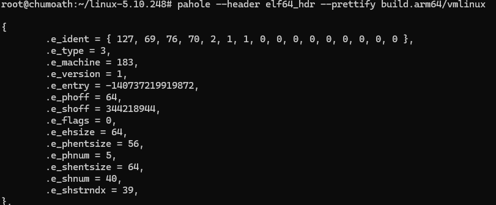
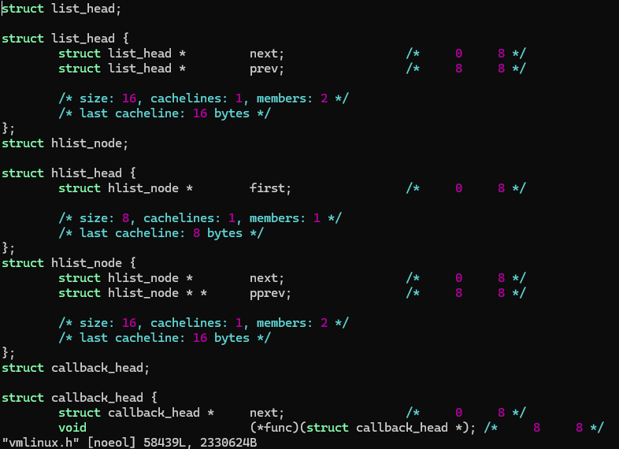
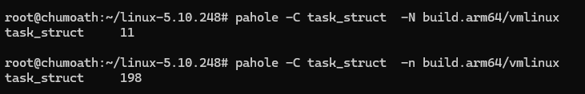
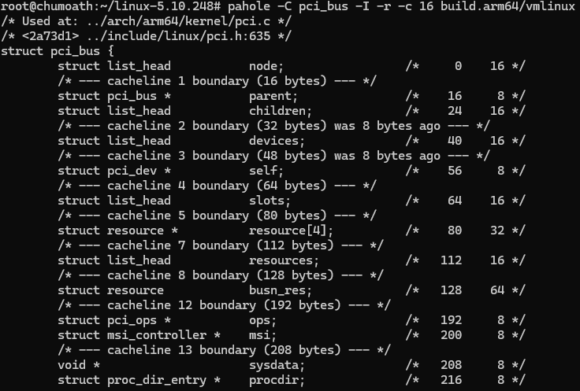
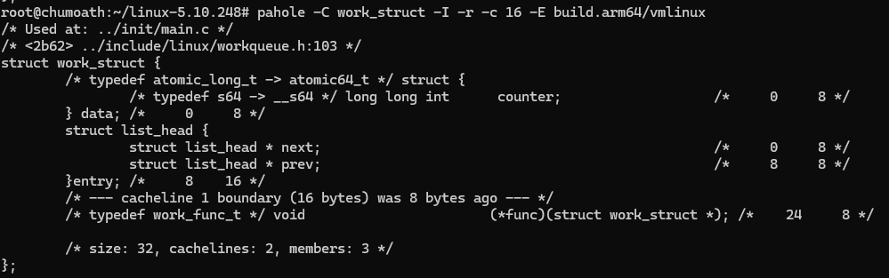
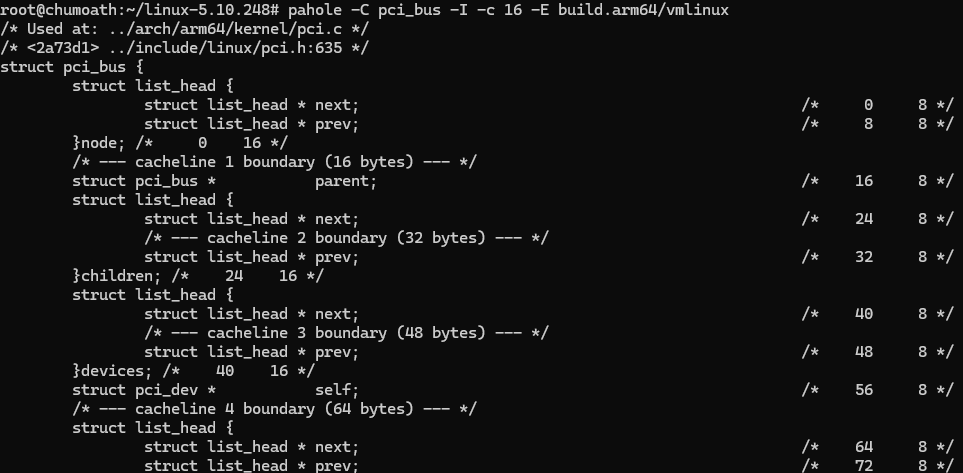
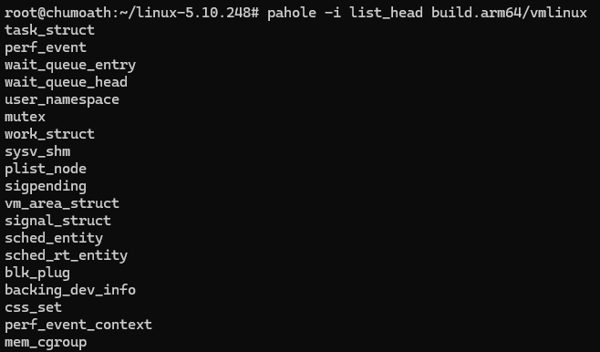
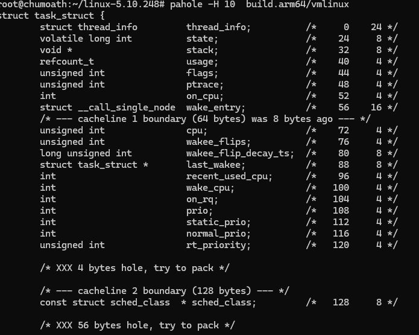
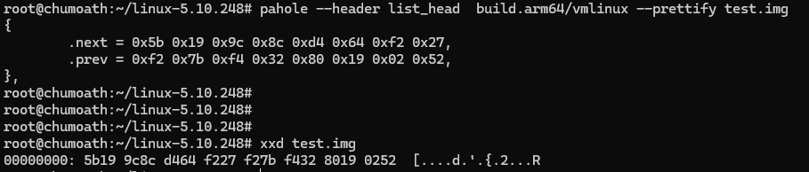

# pahole

- Shows, manipulates data structure layout and pretty prints raw data.

### 0、默认行为

- By default, pahole shows the layout of all named structs in the files specified. 
  - 默认情况，pahole显示指定文件的所有命令的结构体。
- If no files are specified, then it will look if the /sys/kernel/btf/vmlinux is present, using the BTF information present in it about the running kernel.
  - 如果没有文件被指定，查找当前系统的`/sys/kernel/btf/vmlinux`作为输入文件。

### 1、选项列表

| 选项                               | 作用                                                         | 描述                                                         |
| ---------------------------------- | ------------------------------------------------------------ | ------------------------------------------------------------ |
| -C, --class_name=CLASS_NAMES       | Show  just  these  classes. This  can  be  a  comma  separated list of class names or file URLs (e.g.: file://class_list.txt) | 只显示指定类；多个类可以用逗号分开，或者写到一个文件         |
| -c, --cacheline_size=SIZE          | Set cacheline size to SIZE bytes.                            | 设置cacheline的大小，分析结构体数据跨越cacheline的情况       |
| --hex                              | Print offsets and sizes in hexadecimal.                      | 16进制打印偏移和大小                                         |
| -E, --expand_types                 | Expand class members. Useful to find in what member of inner structs where an offset from the beginning of a struct is. | 扩展结构体的成员，即打印成员的内部结构                       |
| -r, --rel_offset                   | Show relative offsets of members in inner structs.           | 使用-E选项时，打印内部结构体的相对偏移；否则，打印内部结构体的绝对偏移。 |
| -i, --contains=CLASS_NAME          | Show classes that contains CLASS_NAME.                       | 打印包含该类的结构体                                         |
| -n, --nr_members                   | Show number of members.                                      | 只打印结构体的成员个数                                       |
| -N, --class_name_len / -s, --sizes | Show size of classes.                                        | 只打印结构体的名称长度                                       |
| -H, --holes=NR_HOLES               | Show only structs with at least NR_HOLES holes.              | 只查看holes的位置个数至少为NR_HOLES的结构体                  |
| -I, --show_decl_info               | Show the file and line number where the tags were defined, if available in the debugging information. | 打印结构体定义的文件和行号                                   |
| --compile                          | Generate compileable code, with all definitions for all types. | 提取所有类型定义，可被编译                                   |
| -R, --reorganize                   | Reorganize struct, demoting and combining bitfields, moving members to remove alignment holes and  padding. | 调整成员结构，重排内存布局，以减少 holes                     |
| --prettify                         | NaN                                                          | 指定要结构化输出的文件；将文件内容使用指定结构体全部打印出来；把数据当作结构体数组打印；可以手动指定查找结构体的文件，和数据区分 |
| --header                           | NaN                                                          | 指定只打印一次，即头                                         |

### 2、基本输出解析

- `pahole -C device -c 32 build.arm64/vmlinux`

```c
struct device {
        struct kobject             kobj;                 /*     0    64 */
        /* --- cacheline 2 boundary (64 bytes) --- */
        struct device *            parent;               /*    64     8 */
        struct device_private *    p;                    /*    72     8 */
        const char  *              init_name;            /*    80     8 */
        const struct device_type  * type;                /*    88     8 */
        /* --- cacheline 3 boundary (96 bytes) --- */
        struct bus_type *          bus;                  /*    96     8 */
        struct device_driver *     driver;               /*   104     8 */
        void *                     platform_data;        /*   112     8 */
        void *                     driver_data;          /*   120     8 */
        /* --- cacheline 4 boundary (128 bytes) --- */
        struct mutex               mutex;                /*   128    32 */
        /* --- cacheline 5 boundary (160 bytes) --- */
        struct dev_links_info      links;                /*   160    72 */
        /* --- cacheline 7 boundary (224 bytes) was 8 bytes ago --- */
        struct dev_pm_info         power __attribute__((__aligned__(8))); /*   232   304 */
        /* --- cacheline 16 boundary (512 bytes) was 24 bytes ago --- */
        struct dev_pm_domain *     pm_domain;            /*   536     8 */
        /* --- cacheline 17 boundary (544 bytes) --- */
        struct em_perf_domain *    em_pd;                /*   544     8 */
        struct irq_domain *        msi_domain;           /*   552     8 */
        struct dev_pin_info *      pins;                 /*   560     8 */
        raw_spinlock_t             msi_lock;             /*   568     4 */

        /* XXX 4 bytes hole, try to pack */

        /* --- cacheline 18 boundary (576 bytes) --- */
        struct list_head           msi_list;             /*   576    16 */
        const struct dma_map_ops  * dma_ops;             /*   592     8 */
        u64 *                      dma_mask;             /*   600     8 */
        /* --- cacheline 19 boundary (608 bytes) --- */
        u64                        coherent_dma_mask;    /*   608     8 */
        u64                        bus_dma_limit;        /*   616     8 */
        const struct bus_dma_region  * dma_range_map;    /*   624     8 */
        struct device_dma_parameters * dma_parms;        /*   632     8 */
        /* --- cacheline 20 boundary (640 bytes) --- */
        struct list_head           dma_pools;            /*   640    16 */
        struct dma_coherent_mem *  dma_mem;              /*   656     8 */
        struct cma *               cma_area;             /*   664     8 */
        /* --- cacheline 21 boundary (672 bytes) --- */
        struct dev_archdata        archdata;             /*   672     0 */
        struct device_node *       of_node;              /*   672     8 */
        struct fwnode_handle *     fwnode;               /*   680     8 */
        int                        numa_node;            /*   688     4 */
        dev_t                      devt;                 /*   692     4 */
        u32                        id;                   /*   696     4 */
        spinlock_t                 devres_lock;          /*   700     4 */
        /* --- cacheline 22 boundary (704 bytes) --- */
        struct list_head           devres_head;          /*   704    16 */
        struct class *             class;                /*   720     8 */
        const struct attribute_group  * * groups;        /*   728     8 */
        /* --- cacheline 23 boundary (736 bytes) --- */
        void                       (*release)(struct device *); /*   736     8 */
        struct iommu_group *       iommu_group;          /*   744     8 */
        struct dev_iommu *         iommu;                /*   752     8 */
        enum device_removable      removable;            /*   760     4 */
        bool                       offline_disabled:1;   /*   764: 0  1 */
        bool                       offline:1;            /*   764: 1  1 */
        bool                       of_node_reused:1;     /*   764: 2  1 */
        bool                       state_synced:1;       /*   764: 3  1 */
        bool                       dma_coherent:1;       /*   764: 4  1 */

        /* size: 768, cachelines: 24, members: 46 */
        /* sum members: 760, holes: 1, sum holes: 4 */
        /* sum bitfield members: 5 bits (0 bytes) */
        /* padding: 3 */
        /* bit_padding: 3 bits */
        /* forced alignments: 1 */
} __attribute__((__aligned__(8)));
```

- size: 结构体总大小，cachelines：使用的cacheline的个数，members：结构体的成员个数
- sum members：结构体成员本身的大小，holes：padding的位置个数，sum holes：padding的字节数， `XXX 4 bytes hole, try to pack`
- sum bitfield members: 位域成员的个数
- padding: 结构体末尾padding的字节数
- bit_padding：padding的bit数，针对 bitfield
- forced alignments：强制对齐的位置个数，和 holes一样？
- padding是手段，holes是现象；padding会导致未利用的

### 3、holes和padding

##### 1) 定义和区别

- **Padding（填充）**：编译器为了满足后续成员的对齐要求，在前一个成员之后**主动插入**的未使用字节。这些字节是**有目的的**，用于保证硬件能高效访问数据。
- **Holes（空洞）**：通常指因为成员排列顺序不合理，在结构体内部形成的**未使用空间**。从结果看，空洞就是由 padding 造成的。`pahole` 中常将“holes”用于描述结构体内部因填充而产生的空隙数量及总大小。

##### 2) padding和holes的影响

- **内存占用**：过多的 padding 会浪费内存，尤其在大量结构体实例（如内核中数十万个对象）时影响显著。
- **缓存效率**：更小的结构体可以更好地利用 CPU 缓存行，减少缓存缺失。
- **性能优化**：重新排列成员（例如按大小降序排列）可以消除 holes，减少结构体总大小。

### 4、使用

- 查看ELF文件头的结构化信息: `pahole --header elf64_hdr --prettify build.arm64/vmlinux`

  

- 提取所有类型定义，可被编译: `pahole --compile build.arm64/vmlinux > vmlinux.h`

  

- 查看类的成员个数: `pahole -C task_struct -n build.arm64/vmlinux`；查看类的名字长度：`pahole -C task_struct -N build.arm64/vmlinux`

  

- 查看类的成员，包括所在文件/行号，内部成员不扩展：`pahole -C pci_bus -I -r -c 16 build.arm64/vmlinux`

  

- 查看类内部结构体的扩展，内部结构体使用相对偏移：`pahole -C pci_bus -I -r -c 16 -E build.arm64/vmlinux`

  

- 查看类内部结构体的扩展，内部结构体使用绝对偏移：`pahole -C pci_bus -I -c 16 -E build.arm64/vmlinux`

  

- 查看包含指定类的结构体：`pahole -i list_head build.arm64/vmlinux`

  

- 查看holes个数大于等于10的结构体：`pahole -H 10  build.arm64/vmlinux`

  

- 将指定的数据使用一个结构体格式化输出：`dd if=/dev/urandom of=test.img bs=1 count=16; pahole --header list_head  build.arm64/vmlinux --prettify test.img`

  

