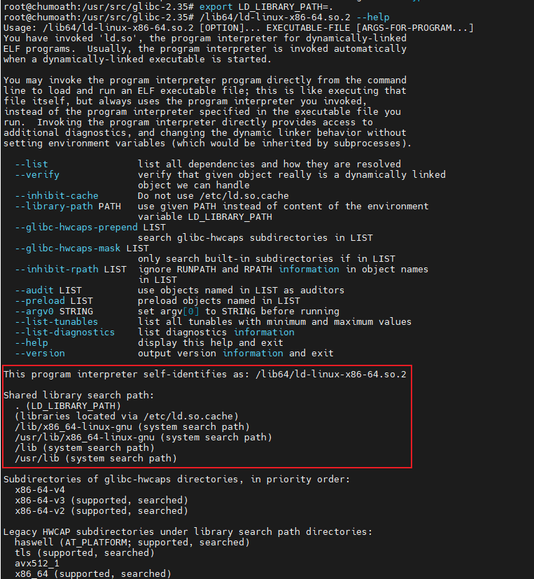
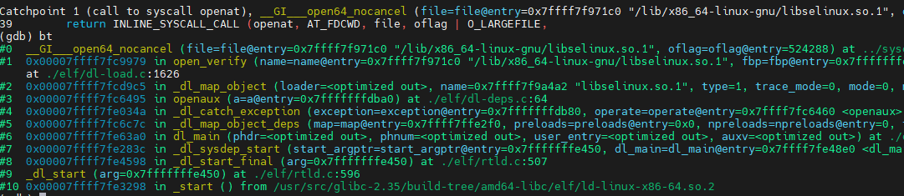
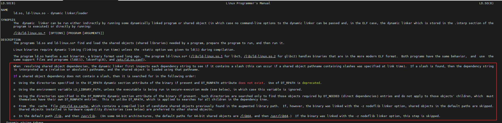

# trick

### 1、调试init进程，或者包装其他进程

```shell
# /usr/local/bin/wget
# chmod +x /usr/local/bin/wget
#!/bin/bash
exec /usr/bin/wget "$@" --no-check-certificate
```

### 2、直接指定动态链接器，不需要内核解析ELF文件拿到动态链接器的路径

```shell
# LD_LIBRARY_PATH 可以独立于当前系统的C库；LD_PRELOAD 可以mock一个动态库的函数(符号解析时从已有符号表找到了就不会从其他动态库找)
LD_LIBRARY_PATH=/ LD_PRELOAD=/lib/x86_64-linux-gnu/libc.so.6 LD_DEBUG=all /lib64/ld-linux-x86-64.so.2 /usr/bin/ls

# ldd /usr/bin/ls
/lib64/ld-linux-x86-64.so.2 --list /usr/bin/ls

# 在openharmony执行ubuntu的strace
# 1) ubuntu
mkdir ubuntu_libs
cp /usr/bin/strace ubuntu_libs/
ldd /usr/bin/strace | cut -d' ' -f3 | xargs -I{} sh -c "cp {} ubuntu_libs"
cp /lib64/ld-linux-x86-64.so.2  ubuntu_libs/

# 2) openharmony
LD_LIBRARY_PATH=ubuntu_libs/ ubuntu_libs/ld-linux-x86-64.so.2 ubuntu_libs/strace /usr/bin/ls
```

### 3、自动创建依赖/动态库路径缓存

```shell
# rpm包经常用
# 1、openeuler用于安装kernel modules后，更新 /boot/initramfs
dracut -f
# 2、查看当前系统的动态库路径缓存
ldconfig -p
# 3、自动更新 /lib/modules/xxx/modules.dep
depmod -a
```

### 4、查看动态链接器的搜索路径

```shell
# 1) 通过 ld.so --help
export LD_LIBRARY_PATH=.:/
/lib64/ld-linux-x86-64.so.2 --help

# 代码路径：
# glibc/elf/dl-usage.c: _dl_help -> print_search_path_for_help

# 2) 通过gdb
apt source glibc
apt build-dep -y .
debuild

gdb ./build-tree/amd64-libc/elf/ld-linux-x86-64.so.2
> set args /usr/bin/ls
> catch syscall openat  # 找到打开依赖的动态库
> run
> p *__rtld_search_dirs.dirs[0]
> p *__rtld_search_dirs.dirs[1]
> p *__rtld_env_path_list.dirs[0]
> p *__rtld_env_path_list.dirs[1]
# 代码路径：_start -> _dl_start -> dl_main -> _dl_map_object_deps -> openaux -> _dl_map_object
# 默认搜索路径：__rtld_search_dirs.dirs
# 环境变量搜索路径：__rtld_env_path_list.dirs，配置了 LD_LIBRARY_PATH 才有
```







### 5、windows/linux使用clion工具编译mixbench

- windows直接使用clion的工具链，不用使用mingw自己装

```shell
# 1) 下载mixbench
git clone https://github.com/ekondis/mixbench.git
# 2) linux 编译
cd mixbench/mixbench-cpu
mkdir build && cd build
cmake -G Ninja ..
ninja
# 3) linux测试
taskset --cpu-list 0 ./mixbench-cpu        # CPU list: #0
taskset 1 ./mixbench-cpu                   # CPU mask: 0x1表示 CPU #0，0x3表示 CPU #0 #1
taskset --cpu-list 1-5:2,4 ./mixbench-cpu  # :2表示步长，即 CPU#1 #3 #5 #4
# 4) windows编译 - 用everything找到 gcc.exe g++.exe cmake.exe ninja.exe的路径，不使用cygwin，加入到PATH环境变量；提示缺openmp的库-libgomp，why?
cmake -G Ninja .
ninja
# 5) windows测试
help start  # 查看start的使用方法
start /affinity 0xF .\mixbench-cpu.exe # 一定是16进制，同linux的taskset
```

- taskset使用

```shell
# 0) 注: 
    # -c: 使用CPU列表；
    # -a 对指定PID的进程的所有线程生效；
    # mask无论是否有 0x前导，都是16进制；
    # 指定 mask/cpulist，则是设置，否则是查询
# 1) 启动命令，并设置CPU亲和性
taskset --cpu-list 0 ./mixbench-cpu        # CPU list: #0
taskset 1 ./mixbench-cpu                   # CPU mask: 0x1表示 CPU #0，0x3表示 CPU #0 #1
taskset --cpu-list 1-5:2,4 ./mixbench-cpu  # :2表示步长，即 CPU#1 #3 #5 #4
taskset 32 ./mixbench-cpu                  # 0x32表示 CPU #1 #4 $5

# 2) 查看指定进程的亲和性
taskset --cpu-list -p 1             # 查看指定进程，输出为CPU列表
taskset -p 1                        # 查看指定进程，输出为CPU mask
taskset -c -a -p 1                  # 查看指定PID所在的进程所有线程的 CPU亲和性，输出为 CPU列表

# 3) 设置指定进程的亲和性
taskset -p --cpu-list 0-3,5  1      # 使用CPU列表设置进程1的CPU的亲和性，只对指定线程的PID生效
taskset -p -a --cpu-list 0-3,5  1   # 使用CPU列表设置线程1所在进程的所有线程的CPU的亲和性
taskset -p -a 0xf 1                 # 使用CPU mask设置线程1所在进程的所有线程的CPU的亲和性
```

### 6、windows可以ping通开发板，开发板不能ping通windows

- 防火墙 -> 入站规则 -> 自定义 -> 所有程序 -> 协议类型(任何) -> 任何IP地址 -> 允许连接
