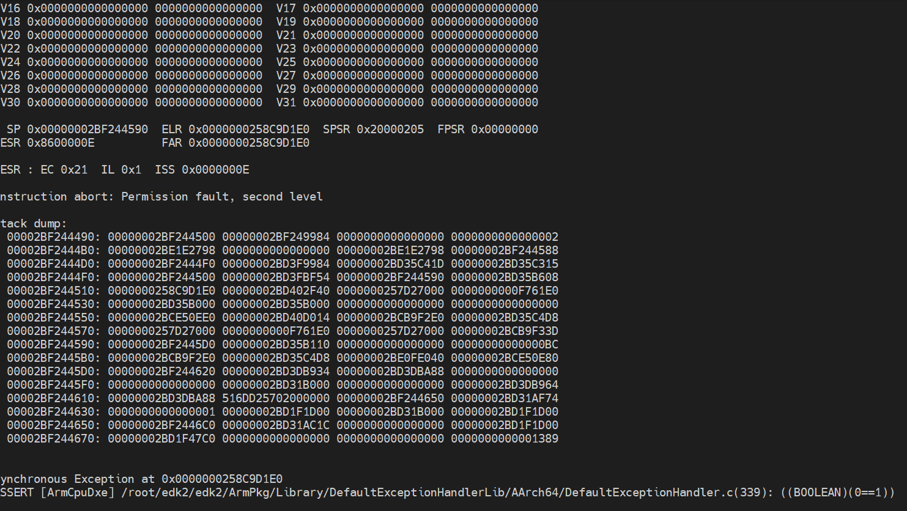

# build_ATF

### 一、edk2构建

- 手动单独构建

```shell
git clone https://github.com/tianocore/edk2.git
cd edk2
# 1) 必须执行，否则会遇到各种各样的文件缺失问题；
# 2) 遇到问题，删除edk2，重新执行该命令
git submodule update --init
make -C BaseTools
source edksetup.sh
export GCC5_AARCH64_PREFIX=aarch64-linux-gnu-
build -a AARCH64 -t GCC5 -p ArmVirtPkg/ArmVirtQemuKernel.dsc
# build -a AARCH64 -t GCC5 -p ArmVirtPkg/ArmVirtQemu.dsc
```

- 使用uefi-tools构建

```shell
# uefi-tools/edk2-platforms.config 添加 armvirtqemukernel64
[armvirtqemukernel64]
LONGNAME=ArmVirtPkg QEMU
DSC=ArmVirtPkg/ArmVirtQemuKernel.dsc
ARCH=AARCH64
./uefi-tools/edk2-build.sh -b DEBUG armvirtqemukernel64
```

## 二、ATF构建

```shell
# 1) 拉取代码
git clone https://github.com/ARM-software/arm-trusted-firmware.git

# 2) 构建ATF
cd arm-trusted-firmware && git checkout -b gxh_dev v2.8
make BL33=/root/edk2/Build/ArmVirtQemuKernel-AARCH64/DEBUG_GCC5/FV/QEMU_EFI.fd \
CROSS_COMPILE=aarch64-linux-gnu- PLAT=qemu all fip DEBUG=1 LOG_LEVEL=50

# 3) 制作BIOS镜像
dd if=build/qemu/debug/bl1.bin of=flash.bin bs=4096 conv=notrunc
# 注意: seek=64
dd if=build/qemu/debug/fip.bin of=flash.bin seek=64 bs=4096 conv=notrunc
cd -

# 4) 运行
/usr/bin/qemu-system-aarch64 -machine virt,secure=on -cpu cortex-a57 -m 10240 \
-smp 4 -bios /root/edk2/arm-trusted-firmware/flash.bin \
-device qemu-xhci -device usb-kbd -device virtio-gpu-pci \
-serial stdio -device usb-mouse -device virtio-scsi-pci,id=scsi0 \
-drive if=none,format=qcow2,file=/var/lib/libvirt/images/ubuntu18.04-aarch64.qcow2,id=hd0 \
-device scsi-hd,bus=scsi0.0,lun=1,drive=hd0

# 修改BIOS的bootorder，来支持有cdrom的时候从HD启动
-device scsi-cd,bus=scsi0.0,lun=0,drive=cd0 \
-drive if=none,format=raw,file=/root/ubuntu-18.04.6j-server-arm64.iso,id=cd0
```

- 报错

  

- 修改

  ```shell
  # 原作者通过和 ubuntu 的 edk2 源代码对比，得知该补丁修改
  ArmVirtPkg/ArmVirt.dsc.inc
  - gEfiMdeModulePkgTokenSpaceGuid.PcdDxeNxMemoryProtectionPolicy|0xC000000000007FD5
  + gEfiMdeModulePkgTokenSpaceGuid.PcdDxeNxMemoryProtectionPolicy|0xC000000000007FD1
  ```

  - [使用ATF引导参考](https://www.cnblogs.com/rayuu/p/17684362.html)

### 三、参考

- [ATF qemu](https://github.com/ARM-software/arm-trusted-firmware/blob/master/docs/plat/qemu.rst)