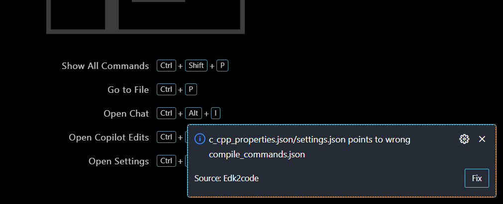
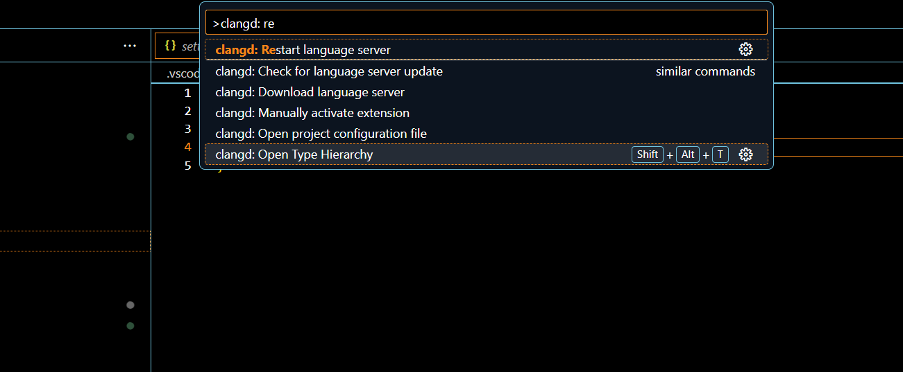

# edk2_vscode

### 一、ubuntu22.04 edk2-vscode插件安装

```shell
# 1、使用最新版的node
从 https://nodejs.org/en/download 直接下载二进制文件即可

# 2、构建edk2-vscode
git clone https://github.com/WalonLi/edk2-vscode.git
cd edk2-vscode
# 设置镜像源，可选
npm config set registry https://mirrors.huaweicloud.com/repository/npm/
# 验证镜像源
npm config get registry
# 若SSL认证失败，使用该环境变量禁用
export NODE_TLS_REJECT_UNAUTHORIZED=0
# 安装依赖
npm install
# 编译
npm run compile

# 3、打包为 vsix
npm install -g vsce
vsce package
```

### 二、Edk2code插件安装

```shell
git clone https://github.com/intel/Edk2Code.git
cd Edk2Code
npm install
npm run compile
vsce package
```

### 三、vscode-server安装和配置

```shell
# 官方链接：https://github.com/coder/code-server.git
# 1、下载 code-server_4.101.1_amd64.deb 或 code-server-4.101.1-amd64.rpm
# 2、安装
#    dpkg -i code-server_4.101.1_amd64.deb
#    rpm -ivh code-server-4.101.1-amd64.rpm
# 3、卸载
#    dpkg -r code-server
#    rpm -e code-server
# 4、配置code-server
# 1) 先运行，生成配置文件
code-server
# 2) 修改 ~/.config/code-server/config.yaml
bind-addr: 0.0.0.0:8888
auth: password
password: gxh
cert: false
# 5、使用
Ctrl + shift + p  => 命令面板
ctrl + ~          => 打开 terminal
```

- 安装vsix插件 (ctrl + shift + p)

  

### 四、clangd + Edk2code自动补全和跳转

```shell
# 1) 安装clang，clangd为语言后台服务器
apt install clang clangd

# 2) 确保edk2包含 BaseTools: Generate compile information in build report 补丁
# 从 edk2-stable202305 开始支持

# 3) 安装 Edk2code 插件
# 4) 构建 edk2，更换版本后，最好删除整个edk2目录，重新 git submodule update --init
git clone https://github.com/tianocore/edk2.git
cd edk2
git submodule update --init
make -C BaseTools
source edksetup.sh
export GCC5_AARCH64_PREFIX=aarch64-linux-gnu-
# 指定 -y 和 -Y 参数
build -a AARCH64 -t GCC5 -p ArmVirtPkg/ArmVirtQemu.dsc -y report.txt -Y COMPILE_INFO
# 生成 edk2/Build/ArmVirtQemu-AARCH64/DEBUG_GCC5/CompileInfo/compile_commands.json
```

- EDK2: Rebuild index database

  

- 选择Build目录

  

- 选择build目标

  

- 修复clangd参数

  

- vscode验证clangd配置

  

- 重启clangd

  

- 后台验证clangd参数

  

- [Edk2code参考](https://zhuanlan.zhihu.com/p/13252846636)